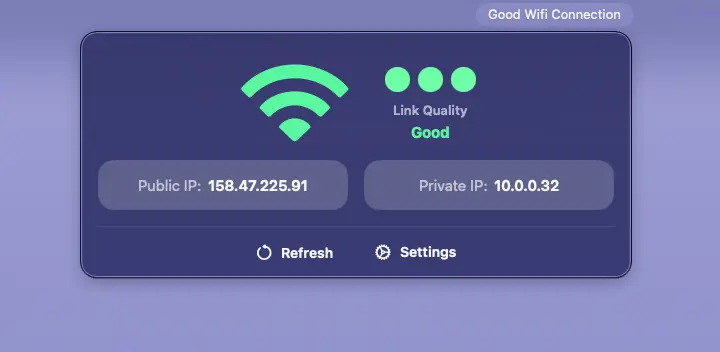
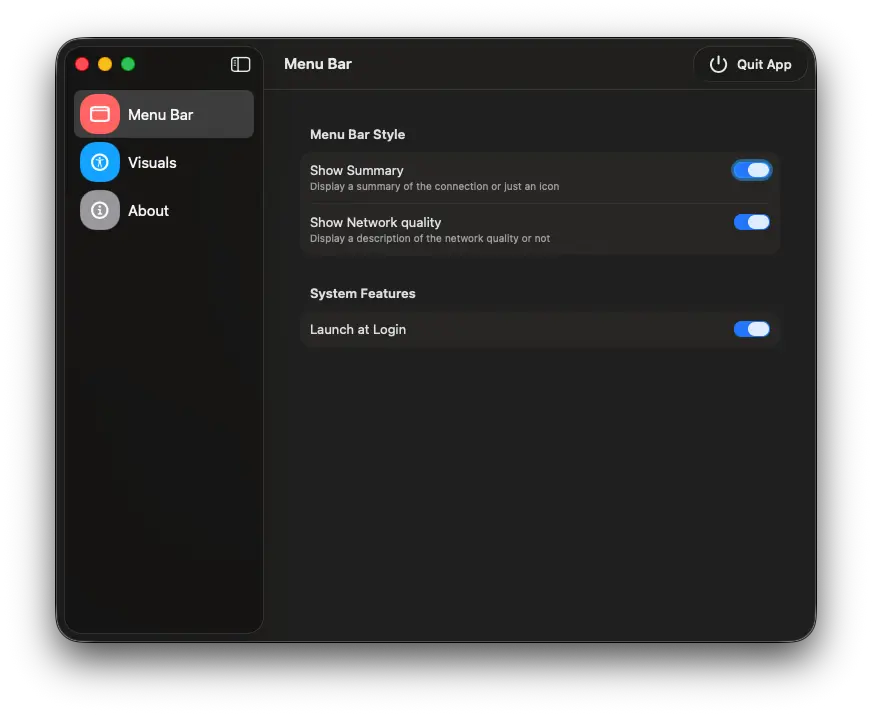

#  QuickNetStats

Essential network statistics directly in the Menu Bar


<p align="center">
  <a href="https://github.com/FI-153/QuickNetStats/stargazers">
    
  </a>
  <a href="https://github.com/FI-153/QuickNetStats/network/members">
    
  </a>
  <a href="https://github.com/FI-153/QuickNetStats/releases">
    
  </a>
</p>

> [!IMPORTANT]
> The app is compatible down to macOS 13 (Ventura) but the network quality information uses an API available from macOS 26 (Tahoe) onwards.

## 🤨 Why?
MacOS is **slow** at realizing you are not connected anymore to the internet and buries the IP information in the settings page.

QuickNetStats instead: 
- Reacts **immediately** when the connections is established or lost;
- Displays an estimate of the **link quality** without a speedtest;
- Lets you see and copy your IPV4 addresses at a glance.

## 🍺 Homebrew Installation (Recommended)
You can install this easily as a cask using  **Homebrew**.
### 1. Add the tap
```bash
brew tap FI-153/tap
```
### 2. Install the cask
```bash
brew install quicknetstats
```
### 3. Updating
To update just use 
``` bash
brew update && brew upgrade quicknetstats
```

## 💾 Direct Download
Download the app then move it from the Downloads folder to the Applications folder

<a href="https://github.com/FI-153/QuickNetStats/releases/download/V.2.0.0/QuickNetStats.app.zip">
  
</a>

## 🛠️ Build from Source
You can also clone this repo, open the project in Xcode and build the app from scratch. If you considered this route you probably don't need any more instruction!

## 💡 Features & Usage
Opening the app displays the status of the current connection in the menu bar. By holding `cmd` you can use the mouse to drag the app to your preferred position in the menu bar. 

> [!NOTE]
> If you are using some utilities like Bartender it may have hidden the app, so you may want to access Bartender's settings to display it.

### Main View
You are presented with 3 essential informations
#### 1. What type of connection you are using
Either WiFi, Ethernet, Hotspot or Other) where the icon is grayed if there are no connection quality informations or they are being computed.


#### 2. The quality of your connection
Either Good, Moderate or Minimal. The last case in the image below shows the monochromatic look.


#### 3. Your current IPV4 addresses
Where clicking either one will copy the address to the clipboard.


### Informations for constrained and network capped networks
Further details are displayes in the main view if you are using Low Data Mode or when using a capped connection like a cellular hotspot.


### Settings
In the settings page you can customize the app's look, its behavior, what is displayed in the Menu Bar and more



## 🛠️ Contributing
Contributions are welcome! To contribute:
- Fork the repository and create your branch;
- Make your changes with clear commit messages;
- Open a pull request describing your changes.

## Acknowledgments
- The public IPV4 address is obtained thanks to [ipify API](https://www.ipify.org)

## Notes
- The link quality is simply an rough estimate. A propper speedtest (e.g. `speedtest-cli`) will always be more accurate but it will take some time. This implementation wins on speed rather than accuracy.
- I developed it using dark mode because i think it looks best, but light mode is fully supported as well
